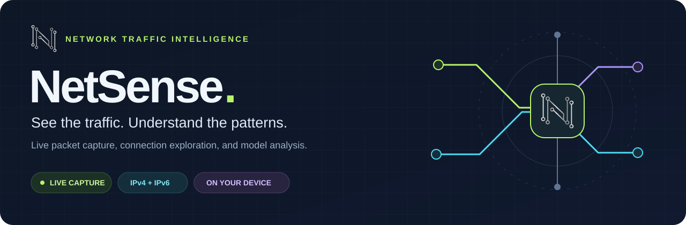
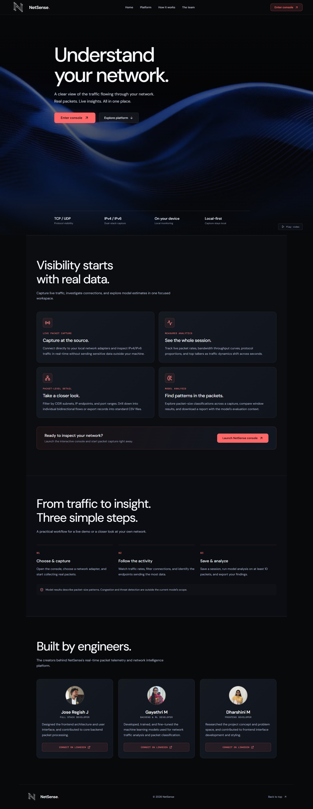
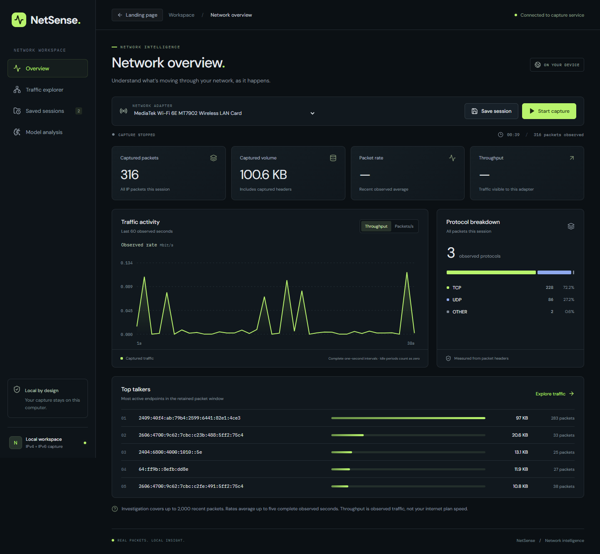
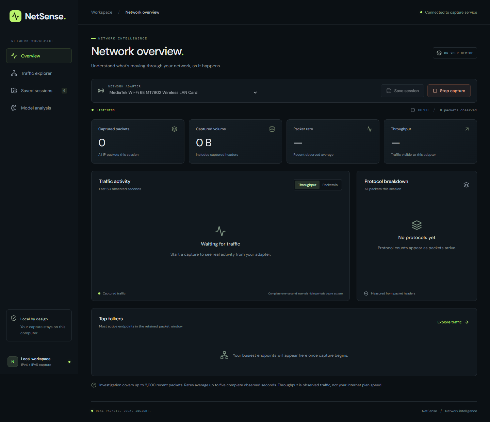
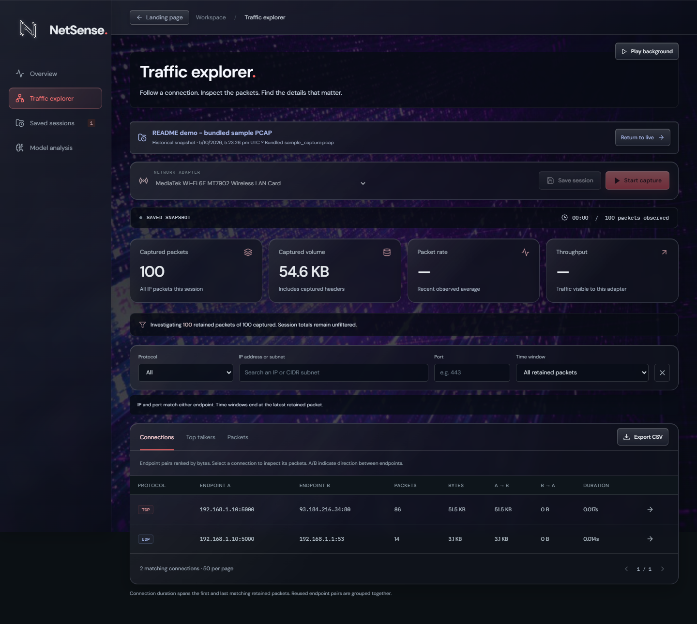
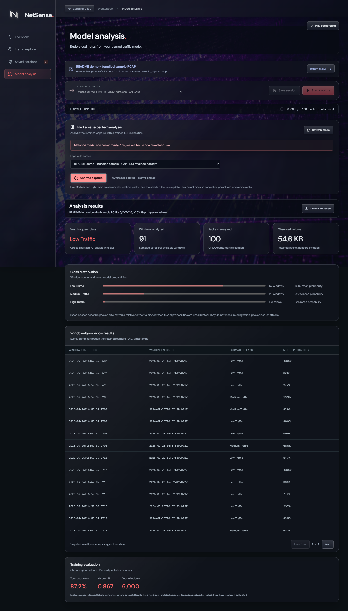
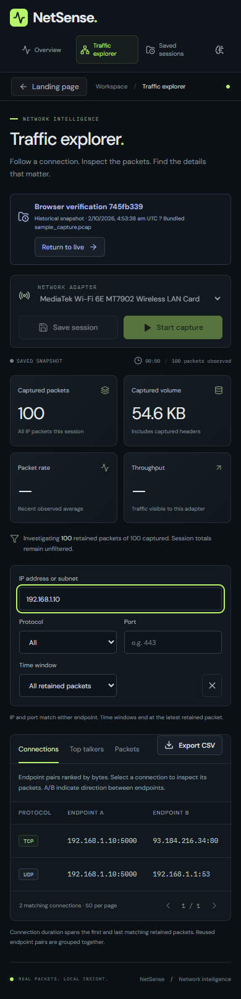

<a id="top"></a>

<p align="center">
  
</p>

<h1 align="center">Your network, in focus.</h1>

<p align="center">
  Capture live traffic, explore connections, and investigate packet-size patterns.<br>
  <strong>A local network intelligence workspace built with React, FastAPI, and PyTorch.</strong>
</p>

<p align="center">
  <a href="#frontend-development"></a>
  <a href="#frontend-development"></a>
  <a href="#start-the-react-app"></a>
  <a href="#start-the-react-app"></a>
  <a href="#model-analysis"></a>
  <a href="LICENSE"></a>
</p>

<p align="center">
  <a href="#screenshots"><strong>📸 Explore the UI</strong></a> ·
  <a href="#start-the-react-app"><strong>🚀 Quick start</strong></a> ·
  <a href="#using-the-dashboard"><strong>🧭 Dashboard guide</strong></a> ·
  <a href="#model-analysis"><strong>🧠 Model analysis</strong></a> ·
  <a href="#frontend-development"><strong>🛠️ Development</strong></a> ·
  <a href="#team"><strong>👥 Team</strong></a>
</p>

---

## Meet NetSense

NetSense turns IPv4/IPv6 packet headers captured by Scapy into a browsable dashboard of live measurements, connections, endpoint rankings, and saved sessions. Capture and investigate traffic visible to your computer's network adapter, all from one local workspace.

<table>
  <tr>
    <td width="33%" valign="top">
      <h3>🟢 Live visibility</h3>
      <p>Watch packet counts, throughput, protocol distribution, and the last 60 observed seconds of activity.</p>
    </td>
    <td width="33%" valign="top">
      <h3>🔵 Traffic explorer</h3>
      <p>Filter by protocol, IP/CIDR, port, or time. Drill into connections, top talkers, and individual packets.</p>
    </td>
    <td width="33%" valign="top">
      <h3>🟣 Model analysis</h3>
      <p>Explore packet-size patterns with a PyTorch LSTM, class distributions, and window-by-window results.</p>
    </td>
  </tr>
  <tr>
    <td valign="top">
      <h3>🟠 Saved sessions</h3>
      <p>Keep capture snapshots in a local SQLite library and revisit them for historical investigation.</p>
    </td>
    <td valign="top">
      <h3>🟡 Useful exports</h3>
      <p>Download matching investigation rows as CSV and model analysis reports as JSON.</p>
    </td>
    <td valign="top">
      <h3>🩵 Responsive workspace</h3>
      <p>Browse a dark dashboard with paginated tables, live WebSocket updates, and automatic reconnection.</p>
    </td>
  </tr>
</table>

> [!NOTE]
> Built for local, single-user use. Run **one backend worker**; browser tabs share the same capture and saved-session library. See [measurement and storage boundaries](#measurement-and-storage-boundaries) for what the numbers mean.

## Screenshots

Captured from the current UI on **5 October 2026**, with the updated branding, red accents, and glass dashboard surfaces. Data views use the repository's bundled sample PCAP; the capture workspace is shown before starting a capture.

**Landing page** — the new NetSense identity, platform overview, workflow, and team.

[](docs/screenshots/react-landing.png)

**Click a screenshot to view it at full size, or expand a view below.**

<details>
<summary><strong>📊 Network overview — session totals, protocols, and top talkers</strong></summary>

[](docs/screenshots/react-overview.png)

</details>

<details>
<summary><strong>🔴 Capture workspace — ready to start</strong></summary>

[](docs/screenshots/react-live.png)

</details>

<details>
<summary><strong>🔵 Traffic investigation — explore connections and packets</strong></summary>

[](docs/screenshots/react-investigation.png)

</details>

<details>
<summary><strong>🧠 Model analysis — sample results and class distributions</strong></summary>

[](docs/screenshots/react-model-analysis.png)

</details>

<details>
<summary><strong>📱 Mobile layout — a closer look at the compact UI</strong></summary>

<p align="center">
  <a href="docs/screenshots/react-mobile.png"></a>
</p>

</details>

<p align="right"><a href="#top">Back to top ↑</a></p>

---

## Start the React app

### 1 · Check prerequisites

| Requirement | What you need |
| :--- | :--- |
| 🐍 Python | **3.10+** |
| 🟩 Node.js | **20.18+**, with npm |
| 🪟 Windows capture | [Npcap](https://npcap.com/) with **WinPcap compatibility** |
| 🐧 Linux / 🍎 macOS capture | **libpcap** and your system's required capture permissions |

### 2 · Install, build, and launch

Run from the repository root:

```powershell
pip install -r requirements.txt
npm --prefix frontend ci
npm --prefix frontend run build
python run.py
```

### 3 · Open your workspace

Open **[NetSense → http://127.0.0.1:8000](http://127.0.0.1:8000)**, select a network adapter, and click **Start capture**.

FastAPI serves the built frontend and API together; Node is only needed to install/build or develop the frontend. The lockfile pins frontend dependencies, and Vite 6 supports the project's existing Node 20.18 environment.

> [!TIP]
> After changing frontend code, rebuild it and refresh the browser. Stop the server with **Ctrl+C**. If Npcap restricts capture to administrators, run the backend from an Administrator terminal.

## What changed from Streamlit

<details>
<summary><strong>⚡ Explore the React + FastAPI improvements</strong></summary>

- Filters, tabs, pagination, and connection drill-down execute in the browser without Python page reruns.
- A WebSocket delivers capture snapshots once per second. Unchanged packet windows are omitted, and React reuses their existing data instead of reaggregating them.
- Tables render 50 rows per page. All matching retained rows are included in CSV exports.
- Packet capture runs independently of the UI. Optional PyTorch inference loads only when requested and executes outside the API event loop.
- Disconnects are visible, current rates become unavailable, and the frontend reconnects automatically. Inputs remain mounted during live updates.
- Saved sessions use the existing `data/sessions.sqlite3` database; no migration is needed.

</details>

This is a local, single-user application. Browser tabs share one capture and library. Run **one backend worker**. The default server binds only to loopback; this application is not configured for public hosting or multiple users. The Python backend observes traffic visible to the adapter of the computer running it, not the computer visiting a remotely hosted page.

## Using the dashboard

**Capture → Explore → Save → Analyze**

1. Select a network adapter and click **Start capture**. Starting a new capture clears the previous in-memory capture.
2. **Overview** shows full-session counters, the last 60 observed seconds, protocol distribution, and the top retained endpoints.
3. **Traffic explorer** combines protocol, IP/CIDR, port, and time-window filters. Use **Connections**, **Top talkers**, or **Packets**. Arrow buttons open a connection's packets or filter to an IP. Clear filters to return to the full retained window.
4. **Export CSV** downloads all matching rows for the current investigation tab, including rows beyond the current page.
5. **Save session** records the current capture. **Saved sessions** opens historical snapshots and offers explicit deletion. Stop capture separately if you do not want it to continue while reviewing history.
6. **Model analysis** analyzes the retained capture or a selected saved session, shows class distributions and window-by-window results, and downloads a JSON report.

## Model analysis

> [!IMPORTANT]
> AI labels describe **packet-size patterns**. They do not establish congestion, application identity, packet loss, or malicious activity. Model probabilities are uncalibrated; cross-network performance has not been established.

The active, matched bundle is in `models/packet-size-v1/`: weights, `scaler.pkl`, and a training manifest containing file hashes and held-out evaluation. The original standalone weights are preserved. The API rejects missing or mismatched bundle files.

Open **Model analysis**, choose the current capture or a saved session, then click **Analyze capture**. At least **10 retained IP packets** are required. Analysis evaluates up to 100 evenly spaced 10-packet windows across the retained buffer, reports their class counts and mean model probabilities, and offers a JSON report download. Results are snapshots; run again to update them.

<details>
<summary><strong>🧪 Reproduce the model bundle and inspect evaluation details</strong></summary>

To reproduce the bundle from the included training dataset:

```powershell
python -m netsense.ml.train
# Optional controls
python -m netsense.ml.train --epochs 12 --max-samples 24000
```

Training creates both weights and scaler together. The validation set selects the checkpoint; the final test set is evaluated separately. The manifest records the dataset hash, split, thresholds, and evaluation counts. After retraining, click **Refresh model**; the API reloads changed artifacts. These classes describe packet-size patterns relative to the training dataset. Probabilities are uncalibrated, and cross-network performance has not been established.

</details>

<p align="right"><a href="#top">Back to top ↑</a></p>

## Measurement and storage boundaries

| Scope | Retention / limit |
| :--- | :--- |
| 📊 Session counters | All observed IP packets in the session |
| 🔎 Investigation & packet exports | Latest **2,000 retained headers** |
| 📈 Chart history | Up to **60 observed seconds** |
| 💾 Saved library | **50 sessions**, at most **5 MB** each |
| 🧠 Model input | At least **10 retained IP packets** |

<details>
<summary><strong>📏 Read measurement definitions, storage behavior, and model limitations</strong></summary>

- Session counters include all observed IP packets. Investigation and packet exports cover the latest **2,000 retained headers**.
- Connections group protocol and bidirectional endpoint pairs. Duration spans matching retained packets; it is not a measured TCP connection lifetime. Reused endpoint pairs are grouped together.
- IP and port filters match either endpoint. Time windows end at the latest retained packet. Packet timestamps and saved-session times are displayed in UTC.
- Top-talker sent/received bytes are relative to each IP. Adding endpoint totals counts each packet twice.
- Rates average up to five complete observed one-second intervals, including idle intervals. Throughput is visible traffic, not internet plan speed. Loss, congestion window, and timeouts are not measured.
- Saved snapshots include session totals, up to 2,000 headers, and up to 60 seconds of chart history. They do not contain packet payloads or a complete PCAP. Historical snapshots do not show current rates.
- The local SQLite library allows **50 sessions**, at most **5 MB** each, and never automatically deletes an older session. It is excluded from Git. Anyone with access to this local app instance can access that library.
- Abandoned capture stops after roughly 60 seconds without an active consumer. Closing the backend also stops capture.
- AI labels remain estimates derived from packet-size features. They do not establish congestion, application identity, packet loss, or malicious activity. The active bundle is trained with a chronological 70/15/15 split before constructing sequences. Its labels are derived from training-only packet-size thresholds, so evaluation scores describe agreement with those labels, not independent congestion or threat detection.

</details>

---

## Frontend development

Use two terminals in the repository root:

```powershell
# Terminal 1: backend
python -m uvicorn netsense.api:app --host 127.0.0.1 --port 8000

# Terminal 2: frontend with hot reload
npm --prefix frontend run dev
```

Open **[the development UI → http://127.0.0.1:5173](http://127.0.0.1:5173)**. Vite proxies `/api` and WebSocket traffic to the backend. Default local origins on ports 8000 and 5173 are accepted; unrelated browser origins are rejected. Explore the **[interactive API docs](http://127.0.0.1:8000/docs)** while the backend is running.

## Verification

```powershell
python -m unittest discover -s backend/tests -p "test_*.py" -v
npm --prefix frontend test
npm --prefix frontend run build
```

<details>
<summary><strong>🌐 Run the browser checks</strong></summary>

Browser checks require Playwright, Microsoft Edge, and the built app running on port 8000:

```powershell
python scripts/check_react_ui.py
# Optional: also exercise real adapter capture and save via the UI
python scripts/check_react_ui.py --live
```

The browser check uses the bundled PCAP as a clearly identified temporary saved session and deletes only its own test sessions afterwards. It checks the real API/WebSocket connection, filtering, connection drill-down, CSV download, input focus during updates, mobile layout, and deletion.

</details>

## Project structure

<details>
<summary><strong>🗂️ Explore the repository layout</strong></summary>

```text
├── backend/
│   ├── src/netsense/
│   │   ├── api.py            FastAPI routes, WebSocket streaming, and React hosting
│   │   ├── config.py         Centralized paths and runtime configuration
│   │   ├── services/
│   │   │   ├── capture.py    Thread-safe Scapy packet capture & rate measurement
│   │   │   └── sessions.py   Bounded SQLite persistence for saved session snapshots
│   │   └── ml/
│   │       ├── inference.py  PyTorch model inference and feature preprocessing
│   │       ├── model.py      PyTorch LSTM neural network architecture
│   │       └── train.py      LSTM training pipeline with evaluation metrics
│   ├── tests/
│   │   ├── fixtures/         Test packet captures (sample_capture.pcap)
│   │   ├── test_api.py       FastAPI route and WebSocket endpoint tests
│   │   ├── test_capture.py   Live packet capture and metric calculation tests
│   │   ├── test_inference.py ML inference and sequence preprocessing tests
│   │   └── test_sessions.py  SQLite session store persistence tests
│   └── pyproject.toml        Backend package definition and dependency metadata
├── frontend/
│   ├── src/
│   │   ├── App.tsx           Main dashboard, capture telemetry, and session drawer
│   │   ├── components/
│   │   │   ├── Investigation.tsx Traffic explorer, IP/port filtering, and CSV export
│   │   │   └── TrafficChart.tsx  Real-time SVG packet/throughput rate chart
│   │   ├── hooks/
│   │   │   └── useLiveCapture.ts WebSocket connection hook with auto-reconnect
│   │   ├── lib/
│   │   │   ├── api.ts        REST client and WebSocket stream manager
│   │   │   └── analysis.ts   Client-side flow grouping and top talker rankings
│   │   ├── styles/
│   │   │   └── dashboard.css Responsive dark-mode dashboard styling
│   │   └── types.ts          Shared TypeScript data interfaces
│   ├── package.json          Frontend dependencies and build scripts
│   └── vite.config.ts        Vite build configuration with local API proxy
├── data/
│   ├── samples/              Sample packet captures & CSV traffic data
│   ├── training/             Dataset for model training (output1.csv)
│   └── sessions.sqlite3      Local capture session database (git-ignored)
├── models/
│   ├── packet-size-v1/       Active matched weights, scaler, and training manifest
│   └── tcp_udp_lstm_pytorch.pt Original standalone PyTorch LSTM weights
├── docs/
│   ├── assets/               README banner artwork
│   └── screenshots/          Application UI screenshots (overview, live, explorer, mobile)
├── images/                   Project contributor profile pictures
├── scripts/
│   └── check_react_ui.py     End-to-end browser verification script
├── run.py                    Unified launcher for backend & React UI
└── requirements.txt          Python project dependencies (-e ./backend)
```

</details>

---

<a id="team"></a>

## 👥 Built By

The NetSense platform was conceptualized and built by:

| Builder | Role | Contribution | Profile |
| :--- | :--- | :--- | :--- |
| **Jose Regish J** | **Full Stack Developer** | Designed the frontend architecture and user interface, and contributed to core backend packet processing. | [](https://www.linkedin.com/in/hackerjose25/) |
| **Gayathri M** | **Backend & ML Developer** | Developed, trained, and fine-tuned the machine learning models used for network traffic analysis and packet classification. | [](https://www.linkedin.com/in/gayathri-m-140279394/) |
| **Dharshini M** | **Frontend Developer** | Researched the project concept and problem space, and contributed to frontend interface development and styling. | *Profile Space Reserved* |

---

## 📄 License

This project is open-source and available under the **[MIT License](LICENSE)**.

```text
Copyright (c) 2025 Jose Regish J (hackerjose25)
```

<p align="center">
  <strong>Real packets. Local insight.</strong><br>
  <a href="#top">Back to top ↑</a> · <a href="#start-the-react-app">Launch NetSense →</a>
</p>
